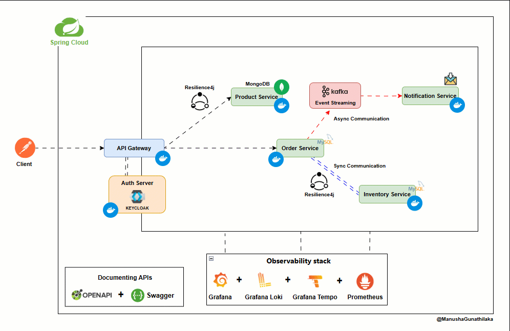

# SpringBoot Microservice FT 🚀


> [!IMPORTANT]
> 📖 **Getting Started?** All detailed setup guides, API documentation, environment variable configs, and working examples are available in the
> [`dev-reference`](https://github.com/ManushaGunathilaka/springboot-microservice-ft/tree/dev-reference)
> branch. **Please refer to that branch before running this project.**

**Short description**
- A compact Spring Boot microservices sample demonstrating API Gateway, Product, Order, Inventory and Notification services.
- Implements Resilience (Resilience4j), Observability (Micrometer, Zipkin,Grafana Stack,Prometheus), async order placement, Kafka (Avro) events and simple email notifications.

**Repository**: https://github.com/ManushaGunathilaka/springboot-microservice-ft

**Table of contents**
- **About**
- **Architecture**
- **Services Breakdown**
- **Tech stack & versions**
- **Getting started**
- **API endpoints overview**
- **Contributing**
- **License**

**About**
- This repository contains a sample Spring Boot microservice suite composed of:
  - an `api-gateway` (Spring Cloud Gateway + OAuth2 resource server (Keycloak) + Resilience4j),
  - a `product` service (MongoDB-backed product CRUD),
  - an `order` service (MySQL-backed, Feign client to inventory, publishes Avro/Kafka events),
  - a `Inventory` service (MySQL-backed inventory check endpoint), and
  - a `notification-service` (Kafka consumer that sends order confirmation emails).

**Architecture**



Simple ASCII overview (service ports configured in each service application.properties):

api-gateway (9000)
└─► Routes to services
├─► product-service (8080)  — MongoDB
├─► order-service (8081)    — MySQL, Feign -> inventory
├─► inventory-service (8082)— MySQL
└─► notification-service (8083) — Kafka consumer / Mail

Event flow:
- order-service publishes `order-placed` (Kafka, Avro) -> notification-service consumes -> sends email

Infrastructure (examples in repo): Docker Compose, Kafka, Schema Registry, MySQL, MongoDB, Zipkin/Tempo, Loki, Prometheus/Grafana.

**Services breakdown**
- api-gateway
  - Location: [api-gateway](api-gateway/pom.xml)
  - Tech: Spring Cloud Gateway, OAuth2 resource-server (JWT), Resilience4j, Springdoc OpenAPI, Actuator, Micrometer.
  - Responsibilities: route aggregation, centralized security, aggregated Swagger UI and circuit-breaker health.

- product-service
  - Location: [product](product/pom.xml)
  - Tech: Spring Boot, Spring Data MongoDB.
  - Key features: exposes product endpoints (`POST /api/product`, `GET /api/product`), stores product data in MongoDB.

- order-service
  - Location: [order](order/pom.xml)
  - Tech: Spring Boot, Spring Data JPA (MySQL), Spring Cloud OpenFeign, Resilience4j, Kafka, Avro.
  - Key features: `POST /api/order` to place orders (async via CompletableFuture), uses Feign to call inventory service to validate stock, publishes `order-placed` Avro event to Kafka.

- Inventory service
  - Location: [Inventory](Inventory/pom.xml)
  - Tech: Spring Boot, Spring Data JPA (MySQL), Flyway, Springdoc.
  - Key features: `GET /api/inventory?skuCode={sku}&quantity={n}` returns boolean for availability.

- notification-service
  - Location: [notification-service](notification-service/pom.xml)
  - Tech: Spring Boot, Kafka consumer (Avro deserializer), JavaMailSender.
  - Key features: listens to Kafka topic `order-placed` and sends email confirmations (Mailtrap settings present in properties).

**Tech stack (detected from pom.xml)**
- Java: 21
- Spring Boot: 4.0.4 (parent pom)
- Spring Cloud BOM: 2025.1.1
- Springdoc OpenAPI: 3.0.0
- Avro: 1.12.1 (order service + generated types)
- Confluent Kafka libs: 7.6.0
- Loki Logback appender: 1.3.2
- MongoDB (product), MySQL (order/inventory), Kafka + Schema Registry (events)

**Getting started**

Prerequisites
- Docker & Docker Compose (for local infra) 🐳
- Java 21 (for building services locally) ☕
- Maven 3.8+ (or use the included `mvnw`) ⚙️

Clone the repo

```bash
git clone https://github.com/ManushaGunathilaka/springboot-microservice-ft.git
cd springboot-microservice-ft
```

Run with docker-compose
- Each service folder contains supporting docker-compose or there may be root orchestration files in the `dev-reference` branch.
- Example (high-level):

```bash
# Start required infra (Kafka, Schema Registry, MySQL, MongoDB, Zipkin, Prometheus, Grafana, etc.)
docker-compose -f docker-compose.yml up --build

# Or consult each folder's docker-compose files under service directories
```

> [!IMPORTANT]
> 📖 **Before Running:** Refer to the
> [`dev-reference`](https://github.com/ManushaGunathilaka/springboot-microservice-ft/tree/dev-reference)
> branch for environment configs and setup instructions.

Notes
- Service ports (from each service application.properties):
  - product: `8080`
  - order: `8081`
  - inventory: `8082`
  - notification: `8083`
  - api-gateway: `9000`

**API endpoints overview (detected from controllers)**
- Product Service ([product/src/main/java/.../ProductController.java](product/src/main/java/com/manu/ms/product/controller/ProductController.java))
  - POST /api/product — create product (request body: ProductRequest)
  - GET  /api/product — list all products

- Inventory Service ([Inventory/src/main/java/.../InventoryController.java](Inventory/src/main/java/com/manu/ms/Inventory/controller/InventoryController.java))
  - GET /api/inventory?skuCode={skuCode}&quantity={quantity} — returns boolean indicating if in-stock

- Order Service ([order/src/main/java/.../OrderController.java](order/src/main/java/com/manu/ms/order/contoller/OrderController.java))
  - POST /api/order — place order (request body: OrderRequest)
  - Internals: uses Feign client `InventoryClient` to call `/api/inventory` and publishes `order-placed` to Kafka when successful.

- Notification Service
  - No public HTTP endpoints — Kafka consumer that listens to `order-placed` and sends emails.

Swagger / OpenAPI
- Each service has Springdoc OpenAPI enabled; api-gateway aggregates service docs under:
  - `/swagger-ui.html` (gateway) with aggregated URLs set in api-gateway properties (see [api-gateway/src/main/resources/application.properties](api-gateway/src/main/resources/application.properties)).

**API Documentation**
- Aggregated (API Gateway): http://localhost:9000/swagger-ui.html (aggregates product, order, inventory)
- Product service: http://localhost:8080/swagger-ui.html
- Order service: http://localhost:8081/swagger-ui.html
- Inventory service: http://localhost:8082/swagger-ui.html
- OpenAPI JSON endpoints:
  - Product: http://localhost:8080/v3/api-docs
  - Order: http://localhost:8081/v3/api-docs
  - Inventory: http://localhost:8082/v3/api-docs

**Contributing**
- Contributions are welcome! Please:
  1. Fork the repo
  2. Create a feature branch
  3. Open a pull request with a clear description
  4. Add/adjust unit tests where applicable

**License**
- No license file detected in this repository. If you plan to reuse or redistribute, please add a `LICENSE` file to clarify terms (e.g., MIT, Apache-2.0).

---

If you'd like, I can:
- generate a compact docker-compose that brings up Kafka, Schema Registry, MySQL, MongoDB and these services for local dev, or
- add a LICENSE file (MIT/Apache) and a short CONTRIBUTING.md.

Happy to continue — tell me which next step you'd prefer! ✨
"# microservice-ft"
# Manusha Gunathilaka - SpringBoot Microservice FT 🚀